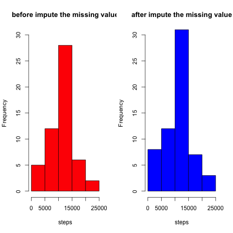

Reproducible Research week 2 Assesment
======================================


## Load & preprocessing data
1. download and save the data into variable

```r
download.file("https://d396qusza40orc.cloudfront.net/repdata%2Fdata%2Factivity.zip",destfile="activity.zip",method="curl")
unzip("activity.zip")
datause<-read.csv("activity.csv")
```

2. convert the date into date format

```r
datause$date<-as.Date(strptime(datause$date,"%Y-%m-%d","GMT"),"%Y%m%d")
```
## What is mean total number of steps taken per day?
1. the total number steps per day  

```r
datano1<-aggregate(steps ~ date,datause,sum)
```
2. histogram of total number steps per day  

```r
par(mfrow=c(1,1))
with(datano1,hist(steps,col="red"))
```


3. Calculate the mean and median for total number steps per day

```r
mean_no1<-round(mean(datano1$steps),1)
median_no1<-median(datano1$steps)
```
* mean = 1.07662 &times; 10<sup>4</sup>
* median = 10765

## What is the average daily activity pattern?
1. plot between average number of steps & 5 minutes interval across days

```r
datano2<-aggregate(steps ~ interval,datause,mean)
with(datano2,plot(interval,steps,type="l",col="blue"))
```


```r
max_interval<-datano2[which(datano2[,2]==max(datano2[,2])),1]
```
2. across the days, 5 minutes interval with maximum average of steps is 835

## Imputing Missing Value
1. Calculate total number of missing value

```r
stepsna<-sum(is.na(datause$steps))
paste("Total number of records missing value is",stepsna)
```

```
## [1] "Total number of records missing value is 2304"
```
2. method to calculate missing value is using/estimated from the average steps by interval across all days

```r
meansteps<-aggregate(steps ~ interval,subset(datause,!is.na(steps)),mean) # get mean of interval from not na
indexna<-which(is.na(datause$steps)) # get index of na
merge_na_vs_est<-merge(meansteps,datause[indexna,],by="interval") #merge to get the estimated steps for na
```
3. Create new dataset with estimated the missing value

```r
datause_no_na<-datause # replicate dataset
datause_no_na[indexna,1]<-merge_na_vs_est[,2]  # update na steps in replicated dataset using estimated
```
4. Create new dataset with estimated the missing value
* Histogram before and after imputed the missing value

```r
datano3<-aggregate(steps ~ date,datause_no_na,sum)
#with(datano3,hist(steps,col="red"))
mean_beforena<-mean(datano1$steps)
median_beforena<-median(datano1$steps)
mean_afterna<-mean(datano3$steps)
median_afterna<-median(datano3$steps)
par(mfrow=c(1,2))
with(datano1,hist(steps,col="red",main="before impute the missing value"))
with(datano3,hist(steps,col="blue",main="after impute the missing value"))
```



* The mean and median before and after imputed the missing value  
a.  **Mean** before imputed missing value is **1.0766189 &times; 10<sup>4</sup>** and after is **1.0766189 &times; 10<sup>4</sup>**  
b.  **Median** before imputed missing value is **10765** and after is **1.1015 &times; 10<sup>4</sup>**  

The impact of before and after imputed the missing value actually not significant because the mean looks similar,  
only median is different, median after imputation is bigger that before but the gap is not that big

## Are there differences in activity patterns between weekdays and weekends?
1. Create variable in the dataset to differentiate weekdays and weekend

```r
datause_no_na$days<-rep("Weekdays",length(datause_no_na$steps))
for (i in 1:length(datause_no_na[,1]))
{
  if ((weekdays(datause_no_na[i,2])=="Sunday") | (weekdays(datause_no_na[i,2])=="Saturday"))
  {
    datause_no_na[i,4]<-"Weekend"
  }
  else
  {
    datause_no_na[i,4]<-"Weekdays"
  }
}
```
2. Create plot which  compare the average steps taken by 5 minutes interval weekdays vs weekend

```r
library(ggplot2)
datano4<-aggregate(steps ~ interval + days,datause_no_na,mean)
g<-ggplot(datano4,aes(interval,steps))
g<-g+geom_line()+facet_grid(.~days)
print(g)
```


